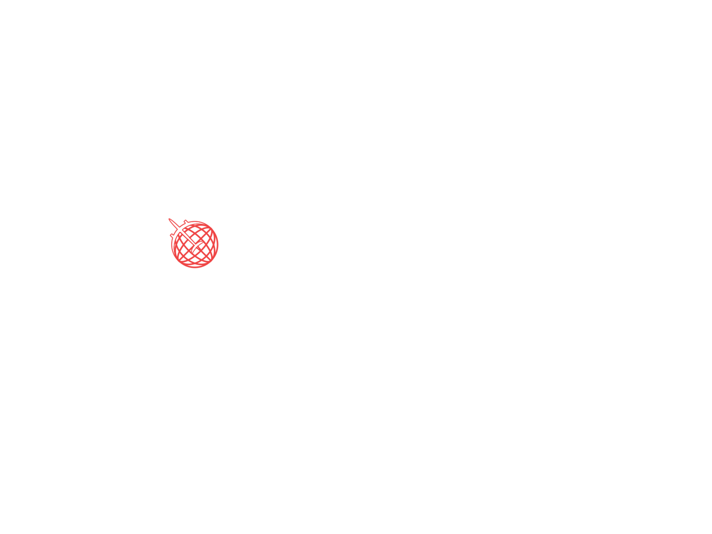

<!-- markdownlint-disable MD014 -->
<!-- markdownlint-disable MD026 -->
<!-- markdownlint-disable MD033 -->
<!-- markdownlint-disable MD041 -->

<h1 align="center">
  Mileva
</h1>

<!-- Banner Section -->
<p align="center">
  
</p>
<h3 align="center">
  A travel app that helps you on your journey
</h3>

---

<!-- Badges Section -->
<p align="center">
  <a href="./LICENSE" title="Show the MIT License">
    
  </a>
  <br>
  
  
  
</p>

<!-- Desktop/Mobile GIF Demo Section -->
<!-- <div align="center">
  
  
</div> -->

---

<!-- Translations Section -->

## 🌎 Translations

<kbd>[](./public/docs/translations/README.en-US.md)</kbd>
<kbd>[](./public/docs/translations/README.pt-BR.md)</kbd>

<!-- Introduction Section -->

## 📖 Introduction

An application that can meet most traveler needs in their
adventures around the world: looking for the best destinations, looking for the best accommodations, analyze reviews of places and services, and organize tasks during the trip.

<!-- Features Section -->

## 🌟 Features

This project features all the latest tools and good practices in mobile development!

### Framework

- ⚛️ **[Expo](https://expo.io/home)** – Build one project that runs natively
  on all your users' devices

### Data Fetching

- ✳️ **[React Query](https://react-query.tanstack.com)** – Hooks for fetching, caching and updating asynchronous data in React
- 🔄 **[Axios](https://github.com/axios/axios)** – Promise based HTTP client for the browser and Node.js

### State Management

- 🐻 **[Zustand](https://zustand-demo.pmnd.rs)** – A small, fast and scalable bearbones state-management solution using simplified flux principles

### Design System and Animations

- 🎨 **[NativeBase](https://nativebase.io)** – Accessible, utility-first component library that helps you build consistent UI across Android, iOS and Web
- ✨ **[React Native Reanimated](https://docs.swmansion.com/react-native-reanimated)** – React Native's Animated library reimplemented

### Form Validation

- 📋 **[React Hook Form](https://react-hook-form.com)** – Performant, flexible and extensible forms with easy-to-use validation
- 🚨 **[Yup](https://github.com/jquense/yup)** – A schema builder for runtime value parsing and validation

### Design Patterns

- ⛔ **[ESLint](https://eslint.org)** – Find and fix problems in your JavaScript code
- 🎀 **[Prettier](https://prettier.io)** – An opinionated code formatter, supporting multiple languages and code editors
- 🐺 **[Husky](https://github.com/typicode/husky)** – Modern native Git hooks made easy
- 💩 **[lint-staged](https://github.com/okonet/lint-staged)** – Run linters against staged git files and don't let 💩 slip into your code base
- 📓 **[commitlint](https://commitlint.js.org)** – Helps your team adhering to a commit convention

<!-- Procedures Section -->

## ▶️ Getting Started

### 🛠️ Installation

Open your terminal and run this command:

```bash
 $ git clone https://github.com/gmatthewsfeuer/mileva.git
```

Move yourself to the root of the project:

```bash
$ cd <name-of-your-generated-repository>
```

Install all dependencies of the project:

```bash
$ npm install
# or
$ yarn install
```

### ⌨️ Development

Once all dependencies have been installed, you can run the local development server:

```bash
$ npm run start
# or
$ yarn start
```

Done!

<!-- Contributors Section -->

## 👥 Contributors

<table>
 <tbody>
  <tr>
   <td align="center">
    <a href="https://github.com/gmatthewsfeuer">
     
     <br />
     <sub><b>Gustavo Matheus Morinaga Cardoso</b></sub>
    </a>
    <br />
    <a href="https://github.com/gmatthewsfeuer/mileva/commits?author=gmatthewsfeuer" title="Code">💻</a>
    <a href="#maintenance-gmatthewsfeuer" title="Maintenance">🚧</a>
    <a href="https://github.com/gmatthewsfeuer/mileva/commits?author=gmatthewsfeuer" title="Documentation">📖</a>
    <a href="#example-gmatthewsfeuer" title="Examples">💡</a>
    <a href="#design-gmatthewsfeuer" title="Design">🎨</a>
   </td>
   <td align="center">
    <a href="https://github.com/gmbrunoo">
     
     <br />
     <sub><b>Bruno Godinho</b></sub>
    </a>
    <br />
    <a href="https://github.com/gmbrunoo/mileva/commits?author=gmbrunoo" title="Documentation">📖</a>
    <a href="#design-gmbrunoo" title="Design">🎨</a>
   </td>
   <td align="center">
    <a href="https://github.com/gssouza10">
     
     <br />
     <sub><b>Gustavo Silva Gomes de Souza</b></sub>
    </a>
    <br />
    <a href="https://github.com/gssouza10/mileva/commits?author=gssouza10" title="Documentation">📖</a>
   </td>
  </tr>
 </tbody>
</table>

<!-- License Section -->

## 📜 License

This project is licensed under the **MIT License** - see the [LICENSE](../../../LICENSE) page for details.

<!-- Acknowledgment Section -->

---

### ⭐ Give a star if you like this project!

### ❤️ Thanks for your attention!

### 👨‍💻 Good Hacking!
