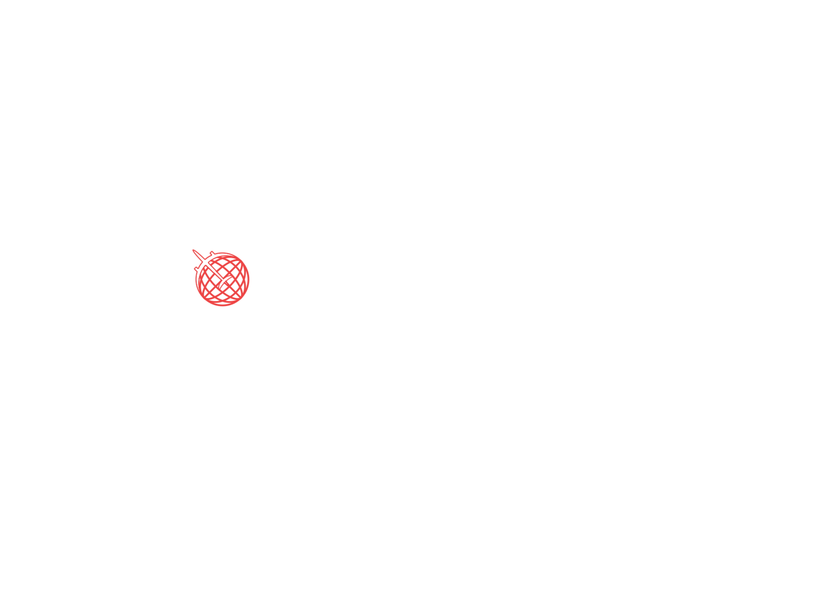

<!-- markdownlint-disable MD014 -->
<!-- markdownlint-disable MD026 -->
<!-- markdownlint-disable MD033 -->
<!-- markdownlint-disable MD041 -->

<h1 align="center">
  Mileva
</h1>

<!-- Seção do Banner -->
<p align="center">
  
</p>
<h3 align="center">
  Um aplicativo de viagens que te ajuda na sua jornada
</h3>

---

<!-- Seção de Distintivos -->
<p align="center">
  <a href="../../../LICENSE" title="Mostrar a Licença MIT">
    
  </a>
  <br>
  
  
  
  <br>
</p>

<!-- Desktop/Mobile GIF Demo Section -->
<!-- <div align="center">
  
  
</div> -->

---

<!-- Seção de Traduções -->

## 🌎 Traduções

<kbd>[](./README.en-US.md)</kbd>
<kbd>[](./README.pt-BR.md)</kbd>

<!-- Seção de Introdução -->

## 📖 Introdução

Um aplicativo que consiga atender a maioria das necessidades do viajante em suas
aventuras pelo mundo todo: buscar os melhores destinos, buscar as melhores hospedagens, analisar as avaliações dos locais e serviços, e organizar as tarefas durante a viagem.

<!-- Seção de Recursos -->

## 🌟 Recursos

Este projeto apresenta todas as ferramentas e boas práticas mais recentes em desenvolvimento mobile!

### Framework

- ⚛️ **[Expo](https://nextjs.org)** – Crie um projeto que seja executado nativamente em todos os dispositivos de seus usuários

### Requisição de Dados

- ✳️ **[React Query](https://tanstack.com/query)** – Hooks para buscar, armazenar e atualizar dados assíncronos em cache no React
- 🔄 **[Axios](https://github.com/axios/axios)** – Cliente HTTP baseado em Promise para o navegador e Node.js

### Gerenciamento de Estado e Hooks

- 🐻 **[Zustand](https://zustand-demo.pmnd.rs)** – Uma solução de gerenciamento de estado de bearbones pequena, rápida e escalável usando princípios de fluxo simplificados
- 👍 **[react-use](https://github.com/streamich/react-use)** – Coleção essencial de React Hooks

### Design System e Estilização

- 🎨 **[NativeBase](https://nativebase.io)** – Biblioteca acessível de componentes utilitários que ajuda você a criar uma interface do usuário consistente no Android, iOS e na Web
- ✨ **[React Native Reanimated](https://docs.swmansion.com/react-native-reanimated)** – Biblioteca animada do React Native reimplementada

### Validação de Formulários

- 📋 **[React Hook Form](https://react-hook-form.com)** – Formulários performáticos, flexíveis e extensíveis com validação fácil de usar
- 🚨 **[Yup](https://github.com/jquense/yup)** – Um construtor de schema para análise e validação de valor em tempo de execução

### Padrões de Projeto

- ⛔ **[ESLint](https://eslint.org)** – Encontre e corrija problemas em seus códigos JavaScript
- 🎀 **[Prettier](https://prettier.io)** – Um formatador opinativo de código, com suporte a várias linguagens e editores de código
- 🐺 **[Husky](https://github.com/typicode/husky)** – Git Hooks nativo e moderno de forma fácil
- 💩 **[lint-staged](https://github.com/okonet/lint-staged)** – Execute linters em arquivos git e não deixe 💩 entrar em sua base de código
- 📓 **[commitlint](https://commitlint.js.org)** – Ajuda sua equipe a aderir a uma convenção de commit
- 🏷️ **[Standard Version](https://github.com/conventional-changelog/standard-version)** – Um utilitário para versionamento usando geração semver e CHANGELOG alimentado por Conventional Commits

<!-- Seção de Procedimentos -->

## ▶️ Começando

### 🛠️ Instalação

Abra o terminal e rode o seguinte comando:

```bash
 $ git clone https://github.com/gmatthewsfeuer/mileva.git
```

Entre na raiz do projeto:

```bash
$ cd <NOME-DO-SEU-REPOSITORIO-GERADO>
```

Instale as dependências do projeto:

```bash
# NPM
$ npm install
# Yarn
$ yarn install
```

### ⌨️ Desenvolvimento

Depois que todas as dependências foram instaladas corretamente, você pode iniciar o servidor local de desenvolvimento:

```bash
# NPM
$ npm run dev
# Yarn
$ yarn dev
```

Pronto!

<!-- Contributors Section -->

## 👥 Contribuidores

<table>
 <tbody>
  <tr>
   <td align="center">
    <a href="https://github.com/gmatthewsfeuer">
     
     <br />
     <sub><b>Gustavo Matheus Morinaga Cardoso</b></sub>
    </a>
    <br />
    <a href="https://github.com/gmatthewsfeuer/mileva/commits?author=gmatthewsfeuer" title="Code">💻</a>
    <a href="#maintenance-gmatthewsfeuer" title="Maintenance">🚧</a>
    <a href="https://github.com/gmatthewsfeuer/mileva/commits?author=gmatthewsfeuer" title="Documentation">📖</a>
    <a href="#example-gmatthewsfeuer" title="Examples">💡</a>
    <a href="#design-gmatthewsfeuer" title="Design">🎨</a>
   </td>
   <td align="center">
    <a href="https://github.com/gmbrunoo">
     
     <br />
     <sub><b>Bruno Godinho</b></sub>
    </a>
    <br />
    <a href="https://github.com/gmatthewsfeuer/mileva/commits?author=gmbrunoo" title="Documentation">📖</a>
    <a href="#design-gmbrunoo" title="Design">🎨</a>
   </td>
   <td align="center">
    <a href="https://github.com/gssouza10">
     
     <br />
     <sub><b>Gustavo Silva Gomes de Souza</b></sub>
    </a>
    <br />
    <a href="https://github.com/gmatthewsfeuer/mileva/commits?author=gssouza10" title="Documentation">📖</a>
   </td>
  </tr>
 </tbody>
</table>

<!-- Seção de Licença -->

## 📜 Licença

Este projeto está licenciado sob a **Licença MIT** - veja a página [LICENÇA](../../../LICENSE) para mais detalhes.

<!-- Seção de Agradecimentos -->

---

### ⭐ Dê uma estrela para manter o projeto!

### ❤️ Obrigado pela atenção!

### 👨‍💻 Bom Hackeamento!
